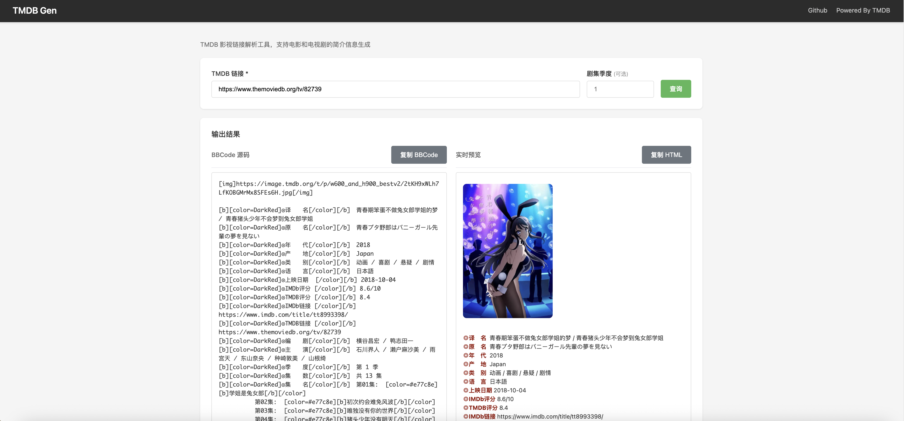

# TMDBGen

基于 TMDB API 的影视信息生成工具，根据 TMDB 链接自动生成格式化的影视简介。


## 功能

- 支持电影和电视剧
- 多语言支持（默认中文）
- BBCode 格式输出/预览

## 预览


## 使用

### Docker Compose 部署

```
version: '3.8'

services:
  tmdb-gen:
    image: pixeasuka/tmdbgen:latest
    ports:
      - "12280:80"
    environment:
      - ACCESS_TOKEN=  # 访问令牌
      #- HTTP_PROXY=代理地址
    restart: unless-stopped
    networks:
      - tmdbgen
      
networks:
  tmdbgen:
    driver: bridge
```

## 环境变量：
```
ACCESS_TOKEN=your_tmdb_access_token_here
HTTP_PROXY=#代理地址(可选)
SERVER_PORT=23333#后端端口(可选)
```

获取 ACCESS_TOKEN：访问 [TMDB API 设置](https://www.themoviedb.org/settings/api) 获取 "API Read Access Token",格式示例：eyj*************

# 3. 访问服务
http://localhost:12280
```


### API 接口

`GET /introduction`

参数：
- `media_link`：TMDB 链接（必填）
- `language`：语言代码，默认 zh-CN（可选）
- `season_number`：电视剧季度号（可选）

示例：
```bash
curl "http://localhost:23333/introduction?media_link=https://www.themoviedb.org/movie/550"
```

## 项目参考
[PT-Gen on Cloudflare Worker](https://github.com/Rhilip/pt-gen-cfworker)

## 许可证

Apache License 2.0
